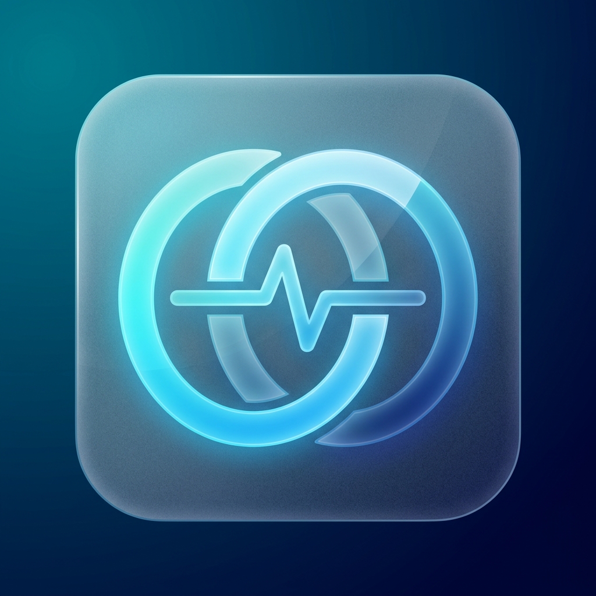

<div align="center">
  
  <h1>GymSync</h1>
  <p><strong>The Premium AI Fitness Ecosystem</strong></p>
  
  <p>
    <a href="#features">Features</a> •
    <a href="#design-philosophy">Design Philosophy</a> •
    <a href="#architecture">Architecture</a> •
    <a href="#getting-started">Getting Started</a>
  </p>
</div>

<br/>

## 🌌 Overview

**GymSync** is not just another workout tracker—it's a high-end, AI-powered biomechanical coaching platform. Built for the modern athlete, GymSync bridges the gap between raw data and actionable fitness intelligence, all wrapped in a visually stunning, immersive user interface. 

Whether you're tracking 1RMs, analyzing your deadlift form, or managing your macros, GymSync provides an elite experience tailored to your exact physiology.

---

## 🎨 Design Philosophy: *Aetheric Athleticism*

GymSync employs a custom design language dubbed **"Aetheric Athleticism"**. We believe fitness apps shouldn't look like spreadsheets. 

- **Deep Space Backgrounds:** Pure `#0A0F0F` backgrounds layered with subtle glowing orbs.
- **Neon Accents:** Primary actions and metrics glow in `Cyan (#00dbe7)` and `Mint (#5adcb3)`.
- **Glassmorphism:** All cards and panels use blurred, semi-transparent overlays (`GlassPanel` components) with thin borders to create depth and hierarchy.
- **Typography:** Crisp, tracking-heavy headers mixed with readable, high-contrast body text.

---

## ✨ Core Features

### 🧠 AI Coach Integration
- Context-aware insights generated from your workout volume, recovery metrics, and sleep data.
- Conversational chat interface for deep-dives into biomechanics, injury prevention, and diet.

### 🏋️‍♂️ Expansive Exercise Library
- Hundreds of meticulously categorized exercises broken down by target muscle groups (Chest, Back, Legs, Core, etc.).
- Dedicated video tutorial and breakdown pages for *every single exercise*, demonstrating perfect form.

### 📊 Advanced Gamification & Metrics
- **Activity Rings:** Real-time visual tracking of Move, Exercise, and Stand goals.
- **AI Score:** A proprietary metric aggregating your consistency, volume progression, and recovery.
- **Heatmaps & PRs:** Beautifully rendered activity charts and Personal Record tracking.

### 💎 Flexible Subscriptions
- **Basic (Free):** Standard tracking and standard AI responses.
- **Pro (₹199/month):** Unlimited advanced biomechanical breakdowns, personalized macro generation, and full access to the extended exercise vault.

---

## 🏗 Architecture & Tech Stack

GymSync is built for peak performance across platforms, utilizing cutting-edge universal app frameworks.

| Technology | Role | Description |
| :--- | :--- | :--- |
| **Expo (React Native)** | Core Framework | Enables universal cross-platform compilation (iOS, Android, Web) from a single codebase. |
| **Expo Router v3** | Routing | File-based routing system with nested `(tabs)` and `(auth)` group structures. |
| **NativeWind** | Styling Engine | Tailwind CSS mapped directly to React Native StyleSheet for rapid, scalable UI development. |
| **react-native-reanimated** | Animations | Liquid-smooth 60fps gesture and micro-interaction animations. |
| **react-native-svg** | Data Visualization | Rendering of custom abstract sparklines and interactive activity rings. |

---

## 🚀 Getting Started

### Prerequisites
Make sure you have Node.js installed and the Expo CLI configured.

```bash
npm install -g expo-cli
```

### Installation

1. **Clone the repository:**
   ```bash
   git clone https://github.com/RishabhArt/GymSync.git
   cd GymSync
   ```

2. **Install dependencies:**
   ```bash
   npm install
   ```

3. **Start the development server:**
   ```bash
   # Use the -c flag to clear the cache and ensure fresh routing
   npm run start -- -c
   ```

4. **Run on your device:**
   - Download the **Expo Go** app on your iOS or Android device.
   - Scan the QR code generated in your terminal to view the app live!

---

## 📱 Navigation Structure

```text
src/app/
 ├── index.tsx                  # Splash & Onboarding Screen
 ├── settings.tsx               # Global Settings
 ├── subscription.tsx           # Pro Tier Upgrade Page
 ├── (auth)/
 │    └── login.tsx             # Authentication Flow
 └── (tabs)/
      ├── _layout.tsx           # Bottom Tab Navigator
      ├── dashboard.tsx         # Main Metrics & Activity Rings
      ├── workout.tsx           # Workout Logger
      ├── coach.tsx             # AI Chatbot Interface
      └── profile.tsx           # User Stats & Settings Gateway
```

---

<div align="center">
  <p>Built with 🩵 by <b>AI Dynamics</b></p>
</div>
